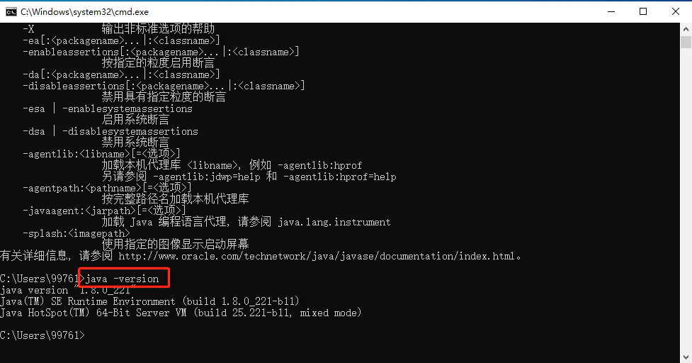
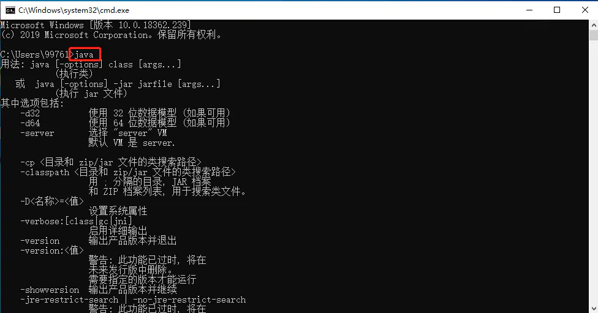
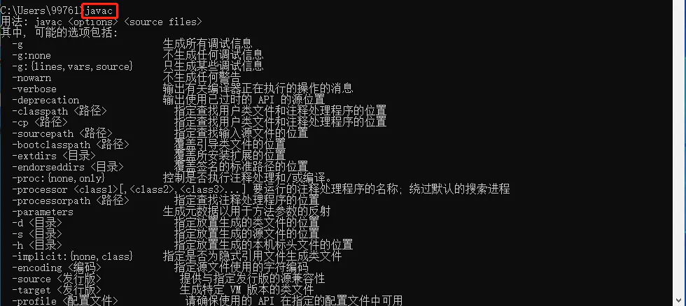

# 1. Java简介与安装配置

## 1.1 Java简介

Java是一门面向对象]编程语言，不仅吸收了C++语言的各种优点，还摒弃了C++里难以理解的多继承、指针等概念，因此Java语言具有功能强大和简单易用两个特征。Java语言作为静态面向对象编程语言的代表，极好地实现了面向对象理论，允许程序员以优雅的思维方式进行复杂的编程。


## 1.2 Java特性

**1.简单性**

Java看起来设计得很像[C++](https://baike.baidu.com/item/C%2B%2B)，但是为了使语言小和容易熟悉，设计者们把C++语言中许多可用的特征去掉了，这些特征是一般程序员很少使用的。例如，Java不支持go to语句，代之以提供[break](https://baike.baidu.com/item/break/405784)和[continue](https://baike.baidu.com/item/continue/3009735)语句以及异常处理。Java还剔除了C++的操作符过载*（**[overload](https://baike.baidu.com/item/overload/5090058)**）*和多继承特征，并且不使用主文件，免去了预处理程序。因为Java没有结构，数组和串都是对象，所以不需要指针。Java能够自动处理对象的引用和间接引用，实现自动的无用单元收集，使用户不必为存储管理问题烦恼，能更多的时间和精力花在研发上。

**2.面向对象**

Java是一个面向对象的语言。对程序员来说，这意味着要注意应中的数据和操纵数据的方法*（method）*，而不是严格地用过程来思考。在一个面向对象的系统中，类*（**[class](https://baike.baidu.com/item/class/12502737)**）*是数据和操作数据的方法的集合。数据和方法一起描述对象*（object）*的状态和行为。每一对象是其状态和行为的封装。类是按一定体系和层次安排的，使得子类可以从超类继承行为。在这个类层次体系中有一个根类，它是具有一般行为的类。Java程序是用类来组织的。

Java还包括一个类的扩展集合，分别组成各种程序包*（**[Package](https://baike.baidu.com/item/Package)**）*，用户可以在自己的程序中使用。例如，Java提供产生图形用户接口部件的类*（**[java.awt](https://baike.baidu.com/item/java.awt)**包）*，这里awt是抽象窗口工具集*（abstract windowing toolkit）*的缩写，处理输入输出的类*（**[java.io](https://baike.baidu.com/item/java.io)**包）*和支持网络功能的类*（**[java.net](https://baike.baidu.com/item/java.net)**包）*。

**3.分布性**

Java设计成支持在网络上应用，它是分布式语言。Java既支持各种层次的网络连接，又以Socket类支持可靠的流*（**[stream](https://baike.baidu.com/item/stream)**）*网络连接，所以用户可以产生分布式的客户机和服务器。

网络变成软件应用的分布运载工具。Java程序只要编写一次，就可到处运行。

**4.编译和解释性**

Java编译程序生成字节码*（byte-code）*，而不是通常的机器码。Java字节码提供对体系结构中性的目标文件格式，代码设计成可有效地传送程序到多个平台。Java程序可以在任何实现了Java解释程序和运行系统*（run-time system）*的系统上运行。

在一个解释性的环境中，程序开发的标准“链接”阶段大大消失了。如果说Java还有一个链接阶段，它只是把新类装进环境的过程，它是增量式的、[轻量级](https://baike.baidu.com/item/轻量级/10002835)的过程。因此，Java支持快速原型和容易试验，它将导致快速程序开发。这是一个与传统的、耗时的“编译、链接和测试”形成鲜明对比的精巧的开发过程。

**5.稳健性**

Java原来是用作编写消费类家用电子产品软件的语言，所以它是被设计成写高可靠和稳健软件的。Java消除了某些编程错误，使得用它写可靠软件相当容易。

Java是一个强类型语言，它允许扩展编译时检查潜在类型不匹配问题的功能。Java要求显式的方法声明，它不支持C风格的[隐式声明](https://baike.baidu.com/item/隐式声明)。这些严格的要求保证编译程序能捕捉调用错误，这就导致更可靠的程序。

可靠性方面最重要的增强之一是Java的存储模型。Java不支持指针，它消除重写存储和[讹误](https://baike.baidu.com/item/讹误)数据的可能性。类似地，Java自动的“无用单元收集”预防存储漏泄和其它有关动态存储分配和解除分配的有害错误。Java解释程序也执行许多运行时的检查，诸如验证所有数组和串访问是否在界限之内。

异常处理是Java中使得程序更稳健的另一个特征。异常是某种类似于错误的异常条件出现的信号。使用try/catch/finally语句，程序员可以找到出错的处理代码，这就简化了出错处理和恢复的任务。

**6.安全性**

Java的存储分配模型是它防御[恶意代码](https://baike.baidu.com/item/恶意代码)的主要方法之一。Java没有指针，所以程序员不能得到隐蔽起来的内幕和伪造指针去指向[存储器](https://baike.baidu.com/item/存储器)。更重要的是，Java编译程序不处理存储安排决策，所以程序员不能通过查看[声明](https://baike.baidu.com/item/声明/13130358)去猜测类的实际存储安排。编译的Java代码中的存储引用在运行时由Java解释程序决定实际存储地址。

Java运行系统使用字节码验证过程来保证装载到网络上的代码不违背任何Java语言限制。这个安全机制部分包括类如何从网上装载。例如，装载的类是放在分开的名字空间而不是局部类，预防恶意的小应用程序用它自己的版本来代替标准Java类。

**7.可移植性**

Java使得语言声明不依赖于实现的方面。例如，Java显式说明每个基本数据类型的大小和它的运算行为*（这些数据类型由Java语法描述）*。

Java环境本身对新的硬件平台和操作系统是可移植的。Java编译程序也用Java编写，而Java运行系统用ANSIC语言编写。

**8.高性能**

Java是一种先编译后解释的语言，所以它不如全编译性语言快。但是有些情况下性能是很要紧的，为了支持这些情况，Java设计者制作了“及时”编译程序，它能在运行时把Java字节码翻译成特定[CPU](https://baike.baidu.com/item/CPU)*（中央处理器）*的机器代码，也就是实现全编译了。

Java字节码格式设计时考虑到这些“及时”编译程序的需要，所以生成机器代码的过程相当简单，它能产生相当好的代码。

**9.多线程性**

Java是多线程语言，它提供支持多线程的执行*（也称为轻便过程）*，能处理不同任务，使具有线索的程序设计很容易。Java的lang包提供一个[Thread](https://baike.baidu.com/item/Thread/5156974)类，它支持开始线索、运行线索、停止线索和检查线索状态的方法。

Java的线索支持也包括一组同步原语。这些原语是基于监督程序和条件变量风范，由C.A.R.Haore开发的广泛使用的同步化方案。用关键词[synchronized](https://baike.baidu.com/item/synchronized)，程序员可以说明某些方法在一个类中不能并发地运行。这些方法在监督程序控制之下，确保变量维持在一个一致的状态。

**10.动态性**

Java语言设计成适应于变化的环境，它是一个动态的语言。例如，Java中的类是根据需要载入的，甚至有些是通过网络获取的。 


## 1.2 Linux环境安装

JDK下载地址：

​     http://www.oracle.com/technetwork/java/javase/downloads/jdk8-downloads-2133151.html

选择 jdk-8uxxx-linux-x64.tar.gz


**解压JDK压缩包**

```
tar zxvf jdk-8uxxx-linux-x64.tar.gz
```


**设置环境变量**

命令行输入 

```shell
sudo vim /etc/profile
```

​    在文件最后，添加如下内容：

```shell
#Java Env
export JAVA_HOME=/usr/你的JDK路径
export CLASSPATH=.:$JAVA_HOME/lib/dt.jar:$JAVA_HOME/lib/tools.jar
export PATH=$PATH:$JAVA_HOME/bin
```

## 1.3 Windows环境安装

### 1.3.1 下载JDK安装包

官网下载：https://www.oracle.com/cn/java/technologies/javase/javase-jdk8-downloads.html


百度云盘下载的适用于window64位计算机。

百度云盘下载：https://pan.baidu.com/s/1LGf3PodzAT1R-7ET1DEOdQ

提取码：s6mg

### 1.3.2 安装JDK

​	直接双击下载好的.exe文件，开始安装，一般默认安装就好了。

​	在这里，可以更改JDK安装的目录。


### 3. 配置JAVA环境

JDK安装好之后，我们需要为计算机配置JAVA环境。

首先，在计算机中打开环境变量。

打开环境变量的方法有很多种，在这里我用的是点击电脑左下方的搜索功能，直接搜索环境变量就可以打开啦。


打开后，继续点击环境变量：


在系统变量中，需要新建一个变量和值。


1. 配置JAVA_HOME


2. 配置CLASSPATH

`CLASSPATH=.;%JAVA_HOME%\lib\dt.jar;%JAVA_HOME%\lib\tools.jar`

注意这里变量值的第一个符号必须是**小数点(.)**。


3. 配置Path

`Path=%JAVA_HOME%\bin;%JAVA_HOME%\jre\bin;`

前两者是新建的，这个是在原有上添加，在最后添加时如果前面没有加分号，当前这条前要加分号。


### 4. 检验安装是否成功

1. 查看java版本

```shell
java -version
```



2. 执行java命令

```shell
java
```



3. 执行javac命令

```shell
javac
```




## 1.3 开发工具

推荐使用idea，安装方式较简单，此处略

📝：Jetbrains可以使用教育邮箱注册免费使用一年

## 参考文献

[1] 董云铮，陈千，梅惠平．Java技术应用：清华大学出版社，2007

[2] 李刚．疯狂Java讲义（第2版）：电子工业出版社，2014

[3] 百度百科 https://baike.baidu.com/item/Java/85979?fr=aladdin#3

[4]《think in java》

[5]《码出高效》

